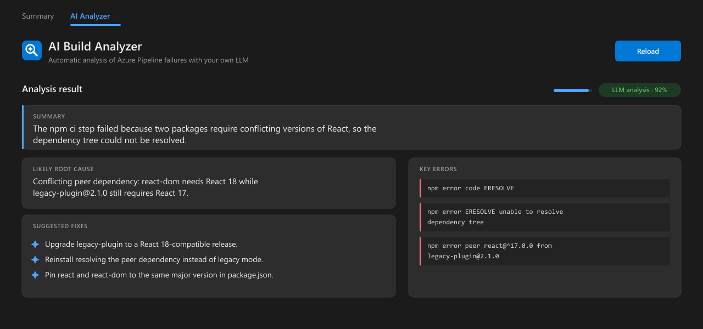

# Azure DevOps Build AI Analyzer

[](https://marketplace.visualstudio.com/items?itemName=ai-build-analyzer.build-failure-analyzer)
[](https://marketplace.visualstudio.com/items?itemName=ai-build-analyzer.build-failure-analyzer)
[](https://marketplace.visualstudio.com/items?itemName=ai-build-analyzer.build-failure-analyzer&ssr=false#review-details)
[](LICENSE)

An Azure DevOps extension that automatically explains **why your pipeline failed** using an LLM of your choice — including a **local, self-hosted model** (Ollama, LM Studio, vLLM, llama.cpp) or any OpenAI-compatible API.

When a build fails, a pipeline task reads the logs of the **failed tasks**, sends them to your LLM, and attaches a structured diagnosis (summary, root cause, key errors, suggested fixes) to the build. An **AI Analyzer** tab on the build results page then shows it.

No separate backend, no extra ports, no inbound network changes to your Azure DevOps server — everything ships inside the extension.



---

## How it works

```
Pipeline fails
  └─> AIBuildAnalyzer task (last step, condition: failed()) runs on the agent
        ├─ reads the failed tasks' logs via the Azure DevOps REST API
        ├─ calls your LLM directly (agent → LLM)
        ├─ falls back to offline heuristics if the LLM is unreachable
        └─ attaches the analysis JSON to the build
AI Analyzer tab on the build results page
  └─ reads that attachment from Azure DevOps (same origin) and displays it
```

Why this design:

- **The LLM is only ever called from the build agent**, not the browser. So your model can live on a private network the browser can't reach.
- **The tab only talks to Azure DevOps itself**, so there is no cross-origin/SSL/mixed-content problem and nothing for users to configure.
- The task **never fails your build** — if anything goes wrong it logs a warning and exits 0.

---

## Requirements

- Azure DevOps Services or Azure DevOps Server (2020+).
- An OpenAI-compatible chat-completions endpoint **reachable from your build agents**.
- [`tfx-cli`](https://github.com/microsoft/tfs-cli) to package the extension (`npm i -g tfx-cli`).

---

## Install

### 1. Package the extension

```bash
npm install            # installs tfx-cli locally
npm run package        # produces <publisher>.<id>-<version>.vsix
```

> If you are **forking this for your own org**, first set your own publisher in
> [`extension/vss-extension.json`](extension/vss-extension.json) (`"publisher"`).
> Create one at https://marketplace.visualstudio.com/manage.

### 2. Upload it

Organization settings → **Extensions** → **Manage Extensions** → **Upload new extension**, then **Install** it into your project. (Or `tfx extension publish --token <PAT>`.)

### 3. Add the task to your pipeline

Add this as the **last step** of the job:

```yaml
- task: AIBuildAnalyzer@2
  displayName: AI Build Analyzer
  condition: failed()
  inputs:
    llmUrl: http://localhost:11434/v1   # your LLM endpoint
    llmModel: llama3.1
```

That's it. From the next failed run onward, open the build's **AI Analyzer** tab.

A full sample is in [`examples/azure-pipelines.yml`](examples/azure-pipelines.yml).

---

## Use your own LLM

The task talks to any **OpenAI-compatible** `/v1/chat/completions` endpoint. You only need to set two inputs: `llmUrl` (base URL ending in `/v1`) and `llmModel`. The **build agent** must be able to reach that URL.

### Inputs

| Input | Default | Description |
|-------|---------|-------------|
| `llmUrl` | `http://localhost:11434/v1` | Base URL of your OpenAI-compatible API (must end in `/v1`). |
| `llmModel` | `llama3.1` | Model identifier your server expects. |
| `llmApiKey` | _(empty)_ | Optional. Sent as `Authorization: Bearer <key>`. Pass a **secret** variable. |
| `insecureTls` | `false` | Set `true` only for HTTPS endpoints with a self-signed/internal certificate. |
| `timeoutMs` | `60000` | Request timeout. Raise it for large/slow local models. |
| `maxLogs` | `25` | Max number of failed-task log files to read. |
| `apiVersion` | `6.0` | Azure DevOps REST API version. Lower it (e.g. `5.0`) if an older on-prem Server returns HTTP 400 reading logs. |
| `readSource` | `false` | Read a small, targeted set of repo files (the files the error references plus common manifests like Dockerfile/package.json) from the agent's checked-out sources, so the LLM can pinpoint the exact fix. Secrets are redacted; files with secret-looking names and `.env`/keys are skipped. |
| `maxSourceBytes` | `8000` | Total size budget for the repo files added to the prompt. Keep small for small-context models. |

### Sharper analysis with source context

By default the analyzer only reads the failure **logs**. Turn on `readSource` to let it also read the **repo files the error points at** (from the agent's checked-out sources — no extra network or credentials), so it can name the exact offending dependency/line instead of a generic suggestion:

```yaml
- task: AIBuildAnalyzer@2
  condition: failed()
  inputs:
    llmUrl: http://localhost:11434/v1
    llmModel: llama3.1
    readSource: true          # read Dockerfile / package.json / etc. as extra context
    maxSourceBytes: '8000'    # keep small for small-context models
```

Secrets are redacted before anything is sent, huge lockfiles are reduced to their suspect version lines, and the total is capped by `maxSourceBytes`.

### Examples for common backends

**[Ollama](https://ollama.com)** (runs the model on the agent or a nearby host):

```yaml
- task: AIBuildAnalyzer@2
  condition: failed()
  inputs:
    llmUrl: http://localhost:11434/v1
    llmModel: llama3.1            # or qwen2.5-coder, mistral, gpt-oss:20b, ...
```

**[LM Studio](https://lmstudio.ai)** (local server, default port 1234):

```yaml
- task: AIBuildAnalyzer@2
  condition: failed()
  inputs:
    llmUrl: http://localhost:1234/v1
    llmModel: your-loaded-model-name
```

**[vLLM](https://github.com/vllm-project/vllm) / llama.cpp / text-generation-webui** (OpenAI-compatible server):

```yaml
- task: AIBuildAnalyzer@2
  condition: failed()
  inputs:
    llmUrl: http://your-gpu-host:8000/v1
    llmModel: meta-llama/Llama-3.1-8B-Instruct
```

**Self-hosted HTTPS with a self-signed/internal certificate:**

```yaml
- task: AIBuildAnalyzer@2
  condition: failed()
  inputs:
    llmUrl: https://llm.internal.example:8443/v1
    llmModel: gpt-oss:20b
    insecureTls: true            # skips TLS verification (curl -k equivalent)
```

**OpenAI / Azure OpenAI or any keyed API** — store the key as a **secret** pipeline variable, then:

```yaml
- task: AIBuildAnalyzer@2
  condition: failed()
  inputs:
    llmUrl: https://api.openai.com/v1
    llmModel: gpt-4o-mini
    llmApiKey: $(OPENAI_API_KEY)  # secret variable, never hard-code keys
```

> **Pick a model that fits the context.** The task trims logs to the error-bearing
> sections, but very large failures still benefit from a model with a decent
> context window. For local use, a small instruct/coder model (7–20B) is usually
> plenty.

### Heuristic fallback (no LLM)

If the LLM is unreachable or times out, the task falls back to a built-in,
offline **heuristic** analyzer that recognizes common CI failures (npm/dependency
errors, Docker build failures, TypeScript/C#/MSBuild errors, YAML syntax,
failing tests, timeouts, auth/registry failures, non-zero exit codes). The tab
labels the result `⚙️ heuristic analysis`; LLM results are labeled `🤖 LLM analysis`.

---

## Repository layout

```
extension/
├── vss-extension.json          # extension manifest (tab + task contributions)
├── content/                    # the "AI Analyzer" build-results tab
│   ├── ai-tab.html / .js / styles.css
│   └── lib/SDK.min.js          # Azure DevOps Extension SDK
└── tasks/ai-analyzer/          # the AIBuildAnalyzer pipeline task
    ├── task.json               # task definition / inputs
    └── index.js                # self-contained Node (no npm dependencies)
examples/azure-pipelines.yml    # sample usage
test/                           # local smoke test + mock AzDO/LLM server
```

---

## Local development & testing

The task is plain Node with no dependencies. A mock Azure DevOps + LLM server and
a smoke test are included:

```bash
npm test
```

This starts [`test/mock-azdo.js`](test/mock-azdo.js), runs the task against it
once with the LLM reachable (expects an `llm` result) and once with it down
(expects the `heuristic` fallback), and asserts the attachment it produces.

To preview the tab UI, open [`extension/content/ai-tab.html`](extension/content/ai-tab.html)
in a browser (it shows the "no analysis" empty state outside Azure DevOps).

After changing anything under `extension/`, bump the version and repackage:

- `extension/vss-extension.json` → `"version"`
- `extension/tasks/ai-analyzer/task.json` → `"version"` (only if the task changed; agents cache the task by version)

```bash
npm run package
```

---

## Troubleshooting

| Symptom | Fix |
|---------|-----|
| Tab says "No analysis recorded for this run" | Is the task in the pipeline? Did the build fail **after** the task was added? |
| Task warning: `No access token available` | The job can't read the OAuth token. In Classic pipelines enable "Allow scripts to access the OAuth token"; in YAML ensure the job authorization scope isn't blocking `System.AccessToken`. |
| Task warning: `LLM analysis failed (...)` | The agent can't reach `llmUrl`. From the agent run `curl <llmUrl>/chat/completions ...`; for self-signed HTTPS set `insecureTls: true`; for slow models raise `timeoutMs`. The build still gets a heuristic result. |
| Task not in the picker | Is the extension installed in the project? Did you bump the task version after changing it? |

---

## License

[MIT](LICENSE) © Mohammad Jafari
